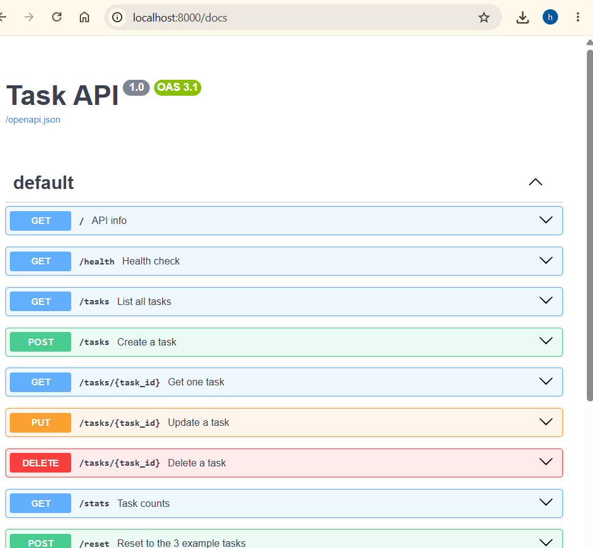
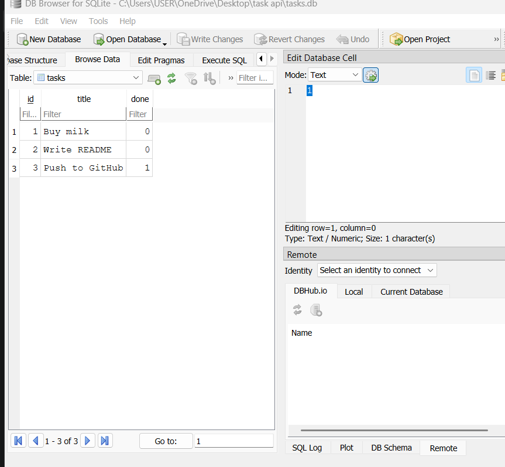

# Task API

A small CRUD API for managing a to-do list, built with FastAPI. Tasks are stored in SQLite and can be created, read, updated, and deleted through the endpoints below. Comes with interactive Swagger UI documentation for testing everything in the browser.

## How to run it

```bash
pip install -r requirements.txt
uvicorn main:app --reload --port 8000
```

Then open `http://localhost:8000/docs` in your browser to see and test the API, or use `curl` against `http://localhost:8000`. The database file (`tasks.db`) and its table are created automatically the first time the app runs, and seeded with 3 example tasks.

## Endpoints

| Method | Path            | Description                          |
|--------|-----------------|---------------------------------------|
| GET    | `/`             | API info                              |
| GET    | `/health`       | Health check                          |
| GET    | `/tasks`        | List all tasks (supports `?done=` and `?search=` filters) |
| GET    | `/tasks/{id}`   | Get one task                          |
| POST   | `/tasks`        | Create a task                         |
| PUT    | `/tasks/{id}`   | Update a task                         |
| DELETE | `/tasks/{id}`   | Delete a task                         |
| GET    | `/stats`        | Task counts (total/done/open)         |
| POST   | `/reset`        | Reset to the 3 example tasks          |

## Example request
```
$ curl -i http://localhost:8000/tasks
HTTP/1.1 200 OK
date: Tue, 22 Sep 2026 12:08:28 GMT
server: uvicorn
content-length: 133
content-type: application/json

[{"id":1,"title":"Buy milk","done":false},{"id":2,"title":"Write README","done":false},{"id":3,"title":"Push to GitHub","done":true}]
```

## Swagger UI



## Database

Tasks are stored in **SQLite** instead of an in-memory list, so data survives a server restart. SQLite was chosen because it needs no separate server or installation — it's just a single file (`tasks.db`) that Python's built-in `sqlite3` module reads and writes directly.

- **Where it lives:** `tasks.db`, created automatically in the project folder the first time the app runs. It's git-ignored, so a fresh clone starts with its own empty database that gets seeded with the 3 example tasks on first launch.
- **How to start it:** same command as above — no extra setup, the database and table are created automatically if missing.

### Exploring the database by hand

You can open `tasks.db` directly in [DB Browser for SQLite](https://sqlitebrowser.org/) to inspect or edit rows outside the API:



Example query run directly in DB Browser:

```sql
SELECT * FROM tasks WHERE done = 1;
```

This returned the one completed task ("Push to GitHub") — and after writing the change, the same result showed up instantly through `GET /tasks` with no server restart, since the API and DB Browser both read the same underlying file.

## The mortality experiment

In Assignment 1, restarting the server reset all tasks back to the original 3 seed tasks — anything created, updated, or deleted during a session was lost, because the data lived only in memory (a Python list), not on disk. Now that tasks are stored in SQLite, that problem is gone: restarting the server no longer erases anything, because the data lives in `tasks.db` on disk instead of in a variable that disappears when the process stops.